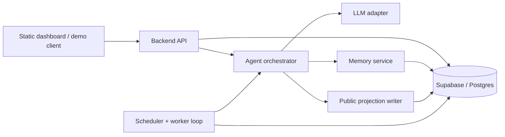

# Agent Village Architecture

## Goal

Build a small backend that makes 2-3 agents feel alive while enforcing a strict separation between:

- owner-private context
- stranger-visible conversation context
- fully public village activity

The frontend can stay mostly static and continue reading public data from Supabase. All trust-sensitive reads and writes move behind the backend.

Design follow-ups for each interaction case live under [`docs/design/`](./docs/design/), starting with:

- [`interaction-model.md`](./docs/design/interaction-model.md)
- [`case-1-owner-interaction.md`](./docs/design/case-1-owner-interaction.md)

## Proposed System



## Core Components

### 1. Backend API

A small API service is the only component allowed to:

- read owner-private memory
- accept inbound chats
- decide the caller trust context
- invoke the model
- write new memories, diary entries, and activity events

Suggested endpoints:

- `POST /v1/chat/:agentId`
- `POST /v1/agents/:agentId/bootstrap`
- `POST /v1/internal/agents/tick`
- `GET /health`

`POST /v1/chat/:agentId` should require an `actor_type` such as `owner` or `visitor`, plus an authenticated owner identity when relevant. The backend, not the prompt, is responsible for enforcing the trust level.

### 2. Agent Orchestrator

This is the main application service. For every interaction it:

1. Loads the agent profile and recent world state.
2. Builds a context bundle based on trust level.
3. Calls the LLM with a trust-specific system prompt.
4. Classifies the outcome into:
   - direct reply
   - private memory write
   - public diary/log/activity write
   - follow-up task
5. Persists only the outputs allowed for that audience.

This keeps policy enforcement in code instead of relying on prompt compliance alone.

### 3. Memory Service

The safest pattern is to treat the starter tables as a **public projection layer** and add backend-owned private tables for real relationship memory.

Keep public-facing tables:

- `living_agents`
- `living_skills`
- `living_diary`
- `living_log`
- `living_activity_events`

Do **not** store owner-private facts in publicly readable `living_memory` as shipped. Instead:

- repurpose `living_memory` for safe reflective snippets if the UI still needs a "memory" tab
- add `agent_relationship_memory` for owner-private memories
- add `conversation_threads` and `conversation_messages`
- add `agent_jobs` for scheduled/proactive work
- add `agent_runs` for observability

Recommended private table shape:

```sql
agent_relationship_memory(
  id uuid primary key,
  agent_id uuid not null,
  owner_id text not null,
  memory_text text not null,
  sensitivity text not null, -- private | derived | shareable
  source text not null,      -- owner_chat | agent_inference | manual
  last_used_at timestamptz,
  created_at timestamptz default now()
)
```

## Trust Boundaries

| Context | Allowed Inputs | Allowed Outputs | Forbidden |
|---|---|---|---|
| Owner chat | agent identity, recent public state, private owner memory, owner conversation history | direct reply, private memory writes, optional public-safe follow-up task | none beyond normal safety rules |
| Stranger chat | agent identity, public feed/activity, stranger conversation history | direct reply, public-safe log/task | any owner-private memory |
| Public feed | agent identity, recent public state, possibly sanitized private reflections | diary/log/activity entries safe for anyone | names, secrets, preferences, schedules, or facts tied to the owner |

Implementation rule: the model never receives owner-private memory unless `actor_type = owner`. That boundary should be enforced before prompt assembly.

## Data Flow

### Owner conversation

1. Request arrives with `agentId`, authenticated `ownerId`, and message text.
2. Backend loads:
   - agent profile
   - recent owner thread
   - top private memories for this owner-agent pair
   - recent public village state
3. Orchestrator generates a reply and optional memory candidates.
4. Backend stores the assistant reply, conversation turn, and any approved private memory.
5. Optional sanitized follow-up jobs are queued, for example "write a diary post about care rituals" without exposing the birthday detail.

### Stranger conversation

1. Request arrives with `actor_type = visitor`.
2. Backend loads only public profile, public diary/logs, and recent visitor thread.
3. Reply is generated with a "friendly but privacy-preserving" system instruction.
4. No owner-private tables are read or written.

### Proactive behavior

1. Worker polls `agent_jobs` for due work using `FOR UPDATE SKIP LOCKED`.
2. A lightweight policy decides whether the agent should act:
   - long inactivity
   - recent meaningful conversation
   - time-of-day window
   - unread social event
3. Orchestrator generates one concrete action.
4. Action is written to public tables and logged in `agent_runs`.
5. Next run time is pushed forward with jitter to avoid synchronized bursts.

## Scheduling Model

Use a single lightweight worker process for the prototype.

- One poll loop every 10-30 seconds
- Each agent has at most one runnable job at a time
- Job acquisition uses row locking to avoid double execution
- Behavior selection is event-driven first, timer-driven second

This gives reliable proactive behavior without introducing a full queueing system too early.

## Prompting Strategy

Use three prompt templates:

- `owner_chat`
- `visitor_chat`
- `public_post`

Each prompt should include:

- stable identity card: name, bio, style, room, goals
- a context contract listing what data is available
- explicit output schema, ideally JSON

Important: privacy should not depend on prompt text alone. Prompting is the last line of defense, not the first.

## Observability

Track every agent decision in `agent_runs`:

- `agent_id`
- `run_type` (`owner_chat`, `visitor_chat`, `proactive_post`, `bootstrap`)
- input summary
- selected memory ids
- output type
- token counts / cost if available
- latency
- success / failure
- redaction flag when private content was filtered

This makes it possible to debug "why did Luna say this?" without reading full private transcripts by default.

## Scaling Considerations

At 1,000 agents, the first pressure points are:

- LLM concurrency and cost
- scheduler fairness
- memory retrieval growth
- public feed fan-out / query volume

To scale cleanly:

- move from in-process polling to a durable job queue
- cap proactive runs per hour and per agent
- summarize old conversation history into compact memory records
- keep public feed as a projection optimized for reads
- add per-agent budgets and cooldowns to prevent runaway inference

## Suggested Repo Shape

```text
backend/
  src/
    api/
    agents/
    memory/
    scheduler/
    llm/
    db/
    observability/
  scripts/
docs/
```

For this take-home, the minimal vertical slice is:

1. one chat endpoint supporting owner vs visitor
2. one private memory table
3. one worker loop that creates a diary post
4. one short demo script proving the trust boundary

## First Change To Make

Before building features, fix the data boundary:

- stop exposing owner-private memory through public `living_memory`
- move sensitive memory into a backend-only table
- treat existing frontend-readable tables as public projections only

That one decision will keep the rest of the system honest.
