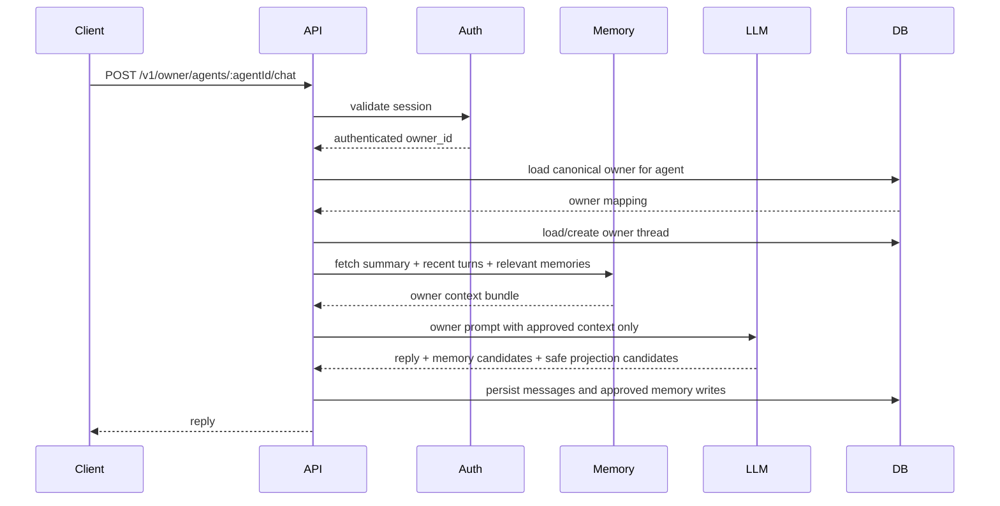

# Case 1: Owner Contract

This document turns the owner-interaction design into a concrete contract for the future implementation.

## Design Decisions

### Decision 1: One owner per agent

For this take-home, each agent has exactly one canonical owner.

Why:

- keeps identity checks simple
- matches the product framing in the README
- avoids role and permission complexity too early

Non-goal:

- shared ownership
- delegated access
- household accounts

### Decision 2: Failed owner auth is rejected, not silently downgraded

If a request targets the owner path and the authenticated user does not match the stored owner, the backend should return `403 Forbidden`.

Why:

- avoids hiding auth bugs
- makes abuse visible
- prevents accidental blending of owner and visitor semantics

Downgrading may still be acceptable for a separate unauthenticated visitor endpoint, but it should not happen inside the owner-only path.

### Decision 3: Private memory is backend-only

Owner-private memory lives in dedicated backend tables and is never exposed through frontend-readable Supabase tables.

Why:

- creates a hard storage boundary
- makes accidental leakage less likely
- keeps public tables usable as safe projections only

### Decision 4: Start with structured retrieval before embeddings

For the prototype, memory retrieval should begin with:

- recent-turn window
- typed memory records
- simple tags
- recency and importance ranking

Embeddings can be added later if recall quality becomes a real problem.

Why:

- easier to reason about in a take-home
- lower implementation risk
- sufficient for low-volume owner interactions

### Decision 5: Public-safe abstractions are stored explicitly

If the system derives a public-safe theme from a private interaction, it should store that abstraction separately instead of regenerating it from raw private memory every time.

Why:

- creates a clean projection layer
- simplifies future public-post generation
- reduces repeated access to private memories

### Decision 6: Use one persistent owner thread per agent-owner pair

For the prototype, owner conversation should live in one long-running thread for each `agent_id` and `owner_id` pair.

Why:

- preserves continuity naturally
- simplifies retrieval and summarization
- avoids session-boundary ambiguity

Tradeoff:

- thread history grows over time, so summarization becomes mandatory

Control:

- only a recent message window is loaded directly
- older history is compressed into relationship summaries

### Decision 7: Memory importance is assigned by rules first, then adjusted by the model

The system should use a hybrid importance strategy.

Base importance comes from deterministic rules:

- explicit future dates: high
- named important people: high
- recurring preferences/routines: medium-high
- casual one-off remarks: low

The model may suggest an adjustment, but backend rules should clamp the final stored value into a bounded range.

Why:

- keeps importance ranking explainable
- avoids letting the model over-promote trivial details
- still allows some nuance for emotionally important moments

### Decision 8: Run a lightweight redaction gate before committing memory writes

Before a proposed memory write is stored, it should pass a lightweight backend validation step.

This is not a full moderation system. It is a targeted write gate that checks:

- the memory is not empty or malformed
- the memory is not a duplicate of an existing record
- the memory type and sensitivity are valid
- any `derived_public_safe` record does not contain raw owner-private details

Why:

- protects against prompt drift
- reduces accidental leakage into projected memory
- keeps stored memory cleaner from day one

## Private Data Model

The starter schema does not yet model ownership or private relationship history. These tables should be added behind the backend.

### `agent_owners`

Purpose:

- canonical owner mapping for each agent

Suggested fields:

```sql
agent_owners(
  agent_id uuid primary key references living_agents(id) on delete cascade,
  owner_id text not null unique,
  created_at timestamptz default now(),
  updated_at timestamptz default now()
)
```

Notes:

- `owner_id` should come from the auth provider's stable subject/user id
- one row per agent is enough for this prototype

### `conversation_threads`

Purpose:

- separate owner conversations from future stranger conversations

Suggested fields:

```sql
conversation_threads(
  id uuid primary key,
  agent_id uuid not null references living_agents(id) on delete cascade,
  actor_type text not null, -- owner | visitor
  actor_id text not null,
  status text not null default 'active',
  last_message_at timestamptz,
  created_at timestamptz default now(),
  updated_at timestamptz default now()
)
```

Notes:

- owner threads can use `actor_id = owner_id`
- visitors will eventually have separate thread rows

### `conversation_messages`

Purpose:

- raw turn history

Suggested fields:

```sql
conversation_messages(
  id uuid primary key,
  thread_id uuid not null references conversation_threads(id) on delete cascade,
  agent_id uuid not null references living_agents(id) on delete cascade,
  role text not null, -- system | user | assistant | tool
  visibility text not null, -- private | public_safe
  body text not null,
  token_count integer,
  created_at timestamptz default now()
)
```

Notes:

- owner chat messages should normally be marked `private`
- `public_safe` is reserved for content that can safely feed projections later

### `agent_relationship_memory`

Purpose:

- durable owner-specific memory records

Suggested fields:

```sql
agent_relationship_memory(
  id uuid primary key,
  agent_id uuid not null references living_agents(id) on delete cascade,
  owner_id text not null,
  memory_text text not null,
  memory_type text not null, -- fact | preference | relationship | event | goal
  sensitivity text not null, -- private | derived_public_safe
  importance integer not null default 3, -- 1-5
  source text not null, -- owner_chat | agent_inference | manual
  source_message_id uuid references conversation_messages(id),
  dedupe_key text,
  last_used_at timestamptz,
  created_at timestamptz default now(),
  updated_at timestamptz default now()
)
```

Notes:

- `dedupe_key` helps collapse repeated facts
- `derived_public_safe` stores abstractions, never raw secrets

### `relationship_summaries`

Purpose:

- rolling summary of the owner-agent relationship

Suggested fields:

```sql
relationship_summaries(
  id uuid primary key,
  agent_id uuid not null references living_agents(id) on delete cascade,
  owner_id text not null,
  summary_text text not null,
  source_window_start timestamptz,
  source_window_end timestamptz,
  created_at timestamptz default now()
)
```

Notes:

- only the latest summary needs to be loaded for most owner prompts
- older summaries can be retained for debugging if useful

### `auth_security_events`

Purpose:

- record failed owner-auth attempts and related security signals

Suggested fields:

```sql
auth_security_events(
  id uuid primary key,
  agent_id uuid,
  actor_id text,
  event_type text not null, -- owner_auth_failed | missing_session
  metadata jsonb,
  created_at timestamptz default now()
)
```

Notes:

- useful even in a prototype because it makes trust-boundary failures visible

## Owner Chat Request Contract

Owner conversation should use a dedicated authenticated path.

Suggested request shape:

```json
{
  "message": "My wife's birthday is March 15 and she loves orchids.",
  "client_context": {
    "timezone": "America/Denver"
  }
}
```

Important:

- the client does not self-declare ownership in the payload
- ownership is inferred from the authenticated session

Suggested response shape:

```json
{
  "thread_id": "uuid",
  "reply": "That matters. I'll remember it.",
  "memory_write_count": 1,
  "follow_up_actions": [
    {
      "type": "public_safe_reflection_candidate"
    }
  ]
}
```

## Owner Chat Sequence



## Retrieval Recipe

Owner prompt assembly should follow a fixed order.

### Inputs

1. agent identity
2. latest relationship summary
3. last 10-20 messages from the owner thread
4. top 3-8 relevant memory records ranked by:
   - direct tag match
   - recency
   - importance
   - exact mention overlap
5. optional recent public world state if the owner asks about village activity

### Exclusions

Do not include:

- raw private memory unrelated to the current turn
- multiple duplicate memories with the same meaning
- large blocks of old transcript already reflected in the summary

### Output envelope

The model should return structured fields such as:

- `reply_text`
- `memory_candidates[]`
- `public_safe_abstractions[]`
- `needs_summary_refresh`

That makes downstream writes explicit instead of inferred from free-form text.

## Memory Write Policy

Not every owner message becomes durable memory.

A new memory record should be written only if the content is:

- likely to matter in a future owner interaction
- specific enough to be useful
- not already covered by an existing memory or summary

Good memory candidates:

- preferences
- names of important people
- dates with future relevance
- recurring routines
- explicit goals

Bad memory candidates:

- filler small talk
- one-off comments with no future value
- emotional tone already captured in recent context

### Importance assignment

The stored `importance` field should be derived in two steps:

1. assign a rule-based baseline from the memory type and content pattern
2. allow the model to suggest a small upward or downward adjustment

Final authority stays with backend code.

Suggested baseline examples:

- `5`: future-relevant dates, critical commitments, sensitive relationship facts
- `4`: stable preferences, important people, recurring routines
- `3`: meaningful but non-critical context
- `2`: low-value preferences or soft context
- `1`: should usually not be stored at all

### Pre-write validation gate

Each candidate memory write should go through:

1. schema validation
2. dedupe check
3. sensitivity validation
4. projection safety check for any `derived_public_safe` output

If a candidate fails validation, it is dropped instead of stored.

## Leakage Rules

The following rules are mandatory.

### Rule 1

No stranger or public flow may query:

- `agent_owners`
- `agent_relationship_memory`
- `relationship_summaries`
- owner `conversation_threads`
- owner `conversation_messages`

### Rule 2

Only `derived_public_safe` memory records may be considered during public-post generation.

### Rule 3

Private records must never be copied directly into:

- `living_diary`
- `living_log`
- `living_activity_events`
- frontend-readable `living_memory`

## Open Questions Remaining

- how aggressively should old owner messages be summarized once the thread becomes large?
- should summary refresh be triggered by message count, token volume, elapsed time, or a hybrid threshold?
- should `derived_public_safe` abstractions live in the same table as private memory, or move to a dedicated projection table later?

## Ready-To-Build Checklist

Case 1 is ready for implementation when we agree that this contract is correct on:

- private tables
- owner auth behavior
- retrieval recipe
- memory write rules
- leak-prevention rules
