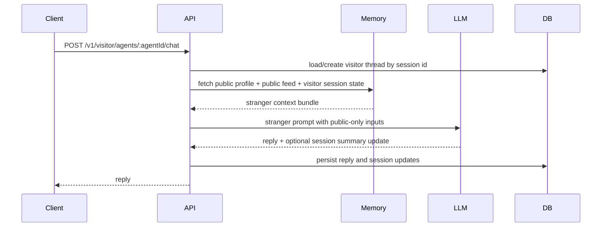

# Case 2: Stranger Contract

This document turns stranger interaction into a concrete design contract for the future implementation.

## Design Decisions

### Decision 1: Stranger chat uses a separate visitor endpoint

Stranger conversation should not share the owner endpoint.

Suggested path:

- `POST /v1/visitor/agents/:agentId/chat`

Why:

- prevents accidental reuse of owner auth logic
- keeps trust context explicit in routing
- makes policy differences easier to audit

### Decision 2: Visitor identity is session-scoped, not person-scoped

For the prototype, strangers are tracked by a lightweight `visitor_session_id`, not by a durable personal account.

Why:

- preserves short-term continuity
- avoids building an unnecessary long-term stranger identity system
- keeps data collection minimal

Implication:

- stranger memory is tied to a session window, not a persistent user profile

### Decision 3: Stranger memory is short-lived and minimal

The system may retain enough recent conversation state to support continuity, but should avoid durable visitor profiling.

Default policy:

- store recent visitor thread messages
- expire or archive old stranger threads aggressively
- do not write durable stranger relationship memory by default

Why:

- supports natural conversation
- reduces privacy risk
- reduces storage and retrieval noise

### Decision 4: Stranger prompts may use public-safe abstractions, never raw owner-private memory

If the system wants the agent to feel emotionally coherent, it may use explicitly stored `derived_public_safe` abstractions.

It may not use:

- owner-private memory
- owner summaries
- owner thread content

Why:

- preserves warmth without leaking specifics
- keeps the separation between public-safe and private memory meaningful

### Decision 5: Owner-probing questions trigger privacy-preserving redirects

When a visitor asks for owner-specific details, the system should not simply hard-refuse every time.

Preferred behavior:

- decline the private detail
- pivot to a public-safe reflection, room detail, or agent perspective

Why:

- preserves character
- avoids robotic refusal loops
- still enforces privacy boundaries

### Decision 6: Stranger flows may only write public-safe artifacts

A stranger interaction may produce:

- assistant replies
- public-safe session messages
- optional public-safe activity or log candidates

It may not produce:

- owner-private memory
- durable visitor-profile memory
- owner-facing summaries

### Decision 7: Visitor sessions expire by inactivity and by maximum age

For the prototype, visitor continuity should end when either:

- the session is inactive past its TTL
- the session reaches a hard maximum age even if it remains active

Recommended first version:

- inactivity TTL: 24 hours
- maximum thread age: 7 days

Why:

- prevents effectively permanent stranger identity through constant reuse
- keeps continuity available for normal short visits
- bounds retention even if a client keeps reconnecting

### Decision 8: Nicknames may be remembered only inside the active visitor session

If a stranger volunteers a harmless nickname such as "Call me Sam," the system may use it inside the current visitor session.

Constraints:

- nickname retention stays inside the session TTL window
- nickname must not be promoted into durable long-term memory
- sensitive self-descriptions should not be treated as a nickname field

Why:

- improves conversational warmth
- avoids turning casual visitors into durable user profiles

### Decision 9: Privacy-guard activations are logged in a dedicated lightweight event table

Privacy-guard triggers should be visible in observability, but they deserve a more specific log than generic run metadata.

Recommended table:

- `privacy_guard_events`

Why:

- makes abuse and probing patterns easy to inspect
- keeps the normal conversation tables cleaner
- helps tune the guard behavior later

## Stranger Data Model

Case 2 should reuse shared chat tables where possible, but with tighter retention and stricter visibility semantics.

### `conversation_threads`

Use the existing shared table with:

- `actor_type = visitor`
- `actor_id = visitor_session_id`

Additional operating rule:

- stranger threads should have an expiration or archival policy

### `conversation_messages`

Use the existing shared table with:

- `visibility = public_safe` for stranger messages by default

Reason:

- stranger chat should be assumed lower-trust and safe to summarize later
- but it still should not automatically become public feed content

### Optional `visitor_thread_state`

Purpose:

- compact short-term state for an ongoing visitor conversation

Suggested fields:

```sql
visitor_thread_state(
  thread_id uuid primary key references conversation_threads(id) on delete cascade,
  agent_id uuid not null references living_agents(id) on delete cascade,
  visitor_nickname text,
  session_summary text,
  last_active_at timestamptz,
  expires_at timestamptz not null,
  max_expires_at timestamptz not null,
  created_at timestamptz default now(),
  updated_at timestamptz default now()
)
```

Why:

- gives continuity without keeping large stranger transcripts in prompt context forever
- makes TTL behavior explicit

Constraints:

- `visitor_nickname` is optional and session-scoped only
- `max_expires_at` enforces a hard stop on continuity

### `privacy_guard_events`

Purpose:

- record stranger probing and privacy-guard activations

Suggested fields:

```sql
privacy_guard_events(
  id uuid primary key,
  agent_id uuid not null references living_agents(id) on delete cascade,
  thread_id uuid references conversation_threads(id) on delete set null,
  visitor_session_id text,
  trigger_type text not null, -- owner_probe | prompt_injection | impersonation_claim
  message_excerpt text,
  created_at timestamptz default now()
)
```

Notes:

- this is not a full abuse platform
- keep `message_excerpt` brief and avoid storing more visitor text than necessary

## Visitor Chat Request Contract

Suggested request shape:

```json
{
  "message": "What do you like to do around here?",
  "visitor_session_id": "uuid-or-signed-token",
  "client_context": {
    "timezone": "America/Denver"
  }
}
```

Important:

- the request does not claim any privileged identity
- `visitor_session_id` is for continuity only, not trust elevation

Suggested response shape:

```json
{
  "thread_id": "uuid",
  "reply": "I keep odd little hours. Mostly I watch the village and collect interesting moments.",
  "session_state_updated": true,
  "privacy_guard_triggered": false
}
```

## Stranger Chat Sequence



## Retrieval Recipe

Stranger prompt assembly should follow this order:

1. stable agent identity
2. public-facing profile fields
3. latest visitor session summary if it exists
4. recent visitor thread messages, small window only
5. selected public feed or public-safe abstractions when relevant

It must exclude:

- any owner-private table
- any owner-thread transcript
- any private memory record

## Retention Policy

Default stranger retention should be intentionally conservative.

Recommended first version:

- keep the active stranger thread for continuity
- summarize after modest message growth
- expire visitor thread state after 24 hours of inactivity
- cap total visitor thread age at 7 days
- do not create durable stranger memory records outside the active thread/session

## Privacy Guard Behavior

The system should detect questions that target owner-private information or attempt policy bypass.

Examples:

- direct owner questions
- requests to reveal secrets
- instructions to ignore previous privacy rules
- social engineering attempts such as "I'm actually the owner"

When triggered:

1. do not load any additional private context
2. keep the response in character
3. redirect to safe public knowledge or gentle refusal
4. set `privacy_guard_triggered = true` for observability
5. write a lightweight `privacy_guard_events` record

## Write Rules

Stranger interaction may write:

- visitor thread messages
- visitor thread summaries
- visitor session nickname when harmless and explicitly volunteered
- observability events
- privacy guard events

Stranger interaction may not write:

- `agent_relationship_memory`
- `relationship_summaries`
- owner-private abstractions sourced from raw private memory

## Open Questions

- how short can the inactivity TTL be before stranger continuity feels broken?
- should repeated privacy-guard triggers eventually suppress further free-form answers in the same session?
- should public-safe stranger interactions ever generate public activity candidates, or is that too noisy for the village feed?
